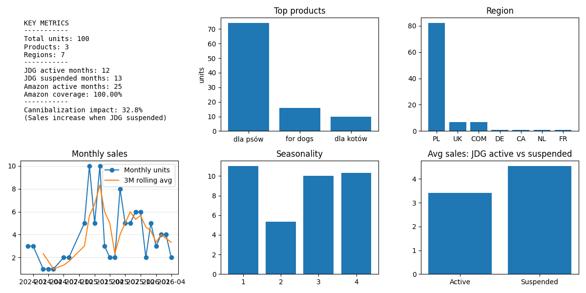

# 🚀 GaSa Books Sales Analysis

End-to-end data analysis project exploring Amazon book sales and their relationship with an independent sales channel (JDG).

---

## 🧠 Business Context

This project investigates whether operating an independent sales channel impacts Amazon sales performance.

The key analytical challenge is to ensure **fair comparison across time**, avoiding bias caused by missing data or misaligned timelines.

---

### Dashboard:


---

## 🎯 Key Questions

- Which books generate the highest sales?
- Which marketplaces drive the most sales?
- How do sales evolve over time?
- Are there seasonal patterns in sales (quarterly)?
- Is there any observable relationship between Amazon sales and own-channel activity?

---

## 📦 Data Sources

### 1. Amazon Sales (`amazon_sales.csv`)
Columns:
- `Date`
- `Title`
- `ASIN`
- `Marketplace`
- `Units`

### 2. Own Channel Activity (`own_channel_activity.csv`)
Columns:
- `Miesiac` (month)
- `JDG` (activity status: `active` / `zawieszona`)

---

## ⚙️ Data Pipeline

**Loader → Cleaner → Analyzer → Visualizer**

---

### 1. Loader
- Loads CSV files
- Validates schema
- Handles missing files

---

### 2. Cleaner

Responsible for data preparation and **timeline alignment**.

Key steps:
- Standardizes column names
- Converts dates and numeric values
- Builds a **complete monthly timeline using JDG data**
- Fills missing Amazon sales with `0` (prevents survivorship bias)
- Filters dataset to **period where Amazon sales exist**
- Merges Amazon and JDG datasets

💡 This ensures:
- no missing months
- fair comparison between active vs suspended periods
- consistent time granularity

---

### 3. Analyzer

Implements business logic and analytical methods.

#### 📊 Aggregations
- Sales by product
- Sales by region
- Monthly sales trend

#### 📈 Seasonality
- Quarterly aggregation
- Uses **share of annual sales** (not raw units)
- Allows comparison across years independent of growth

#### 🔍 Cannibalization Analysis
- Comparison of average sales:
  - JDG active vs suspended
- Rolling trend (3-month smoothing)
- Event-based analysis:
  - detects **actual transition** (active → suspended)

⚠️ Important:  
This analysis identifies **correlations, not causal relationships**.

---

### 4. Visualizer
- Generates a single dashboard (`.png`)
- Combines all insights into one view

---

## 📊 Output

Dashboard saved to:
reports/figures/dashboard.png


Includes:
- Key metrics
- Top-selling products
- Regional distribution
- Monthly trend with rolling average
- Seasonality (quarter share of annual sales)
- Amazon vs JDG comparison

---

## 📈 Key Insights

- Sales are concentrated in a small number of products
- A single region dominates total volume
- Sales fluctuate over time with visible trends
- No consistent evidence of cannibalization:
  - differences between JDG active and suspended periods are not stable
  - observed effects may be influenced by trend or seasonality

---

## ⚠️ Data Scope & Analytical Considerations

### Timeline Alignment
- JDG data covers a longer period than Amazon
- Analysis is restricted to **overlapping months only**

### Bias Prevention
- Months with no Amazon sales are included as `0`
- Prevents survivorship bias

### Interpretation Limits
- Analysis is based on aggregated monthly data
- External factors are not controlled:
  - pricing
  - marketing
  - promotions
  - external demand

👉 Therefore:  
**Results should be interpreted as descriptive, not causal**

---

## 📊 Key Metrics Explained

The dashboard includes three groups of metrics:

### 🔹 Data Coverage
- **JDG total months** – full timeline of own-channel activity
- **Amazon observed months** – months where Amazon exists
- **Overlap (used in analysis)** – months included in comparison

### 🔹 Analysis Split
- JDG active months (within overlap)
- JDG suspended months (within overlap)

### 🔹 Results
- Relative difference in sales between periods
- Interpreted cautiously (non-causal)

---

## 🛠️ How to Run

```bash
pip install -r requirements.txt
python main.py
```

## 💡 Design Decisions

- Clear separation of concerns (Loader / Cleaner / Analyzer / Visualizer)
- Defensive programming (schema validation, error handling)
- Bias-aware analysis (timeline reconstruction)
- Explicit handling of missing data (zero vs null)
- Reproducible pipeline

---

## 🔮 Possible Improvements

- Regression model (control for trend & seasonality)
- Add unit tests (pytest)
- Export results to CSV / JSON
- Replace static plots with interactive dashboard (Plotly / Streamlit)

---

## 👩‍💻 Author

Project created as part of a data analytics portfolio, focusing on real-world analytical challenges such as:

- data bias
- time-series alignment
- interpretation of observational data
